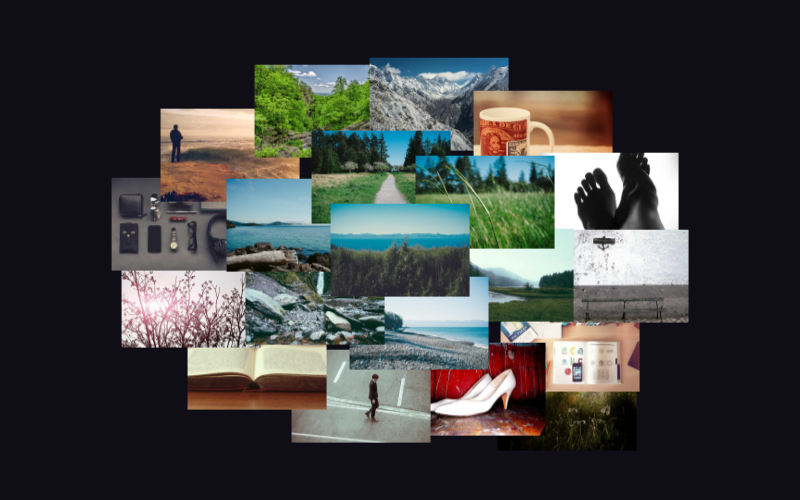
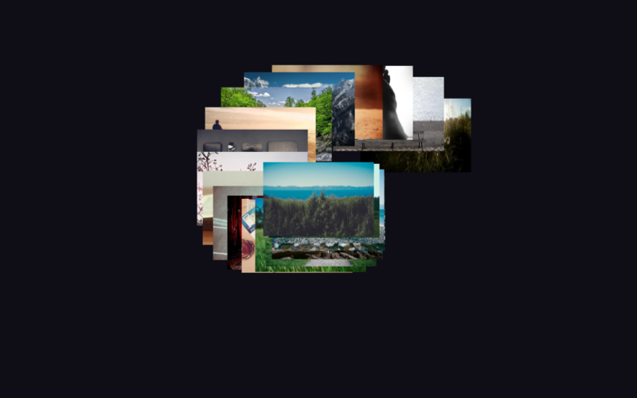
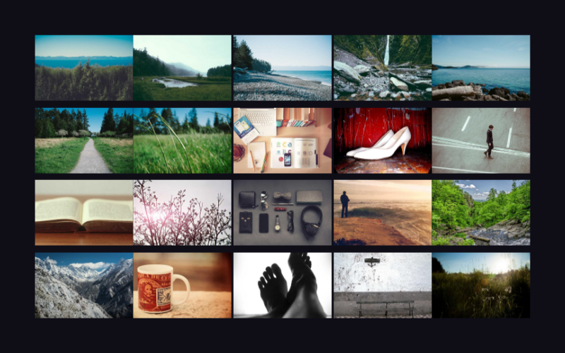
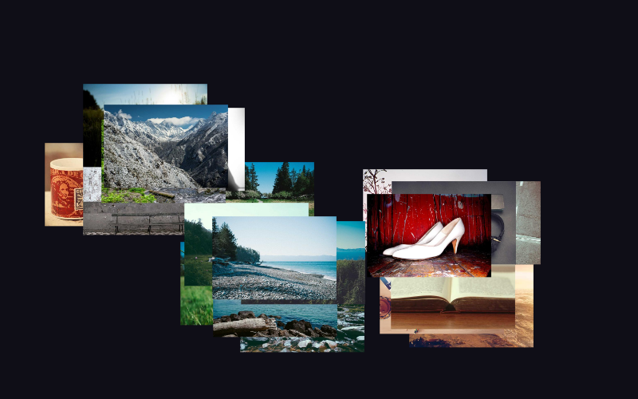
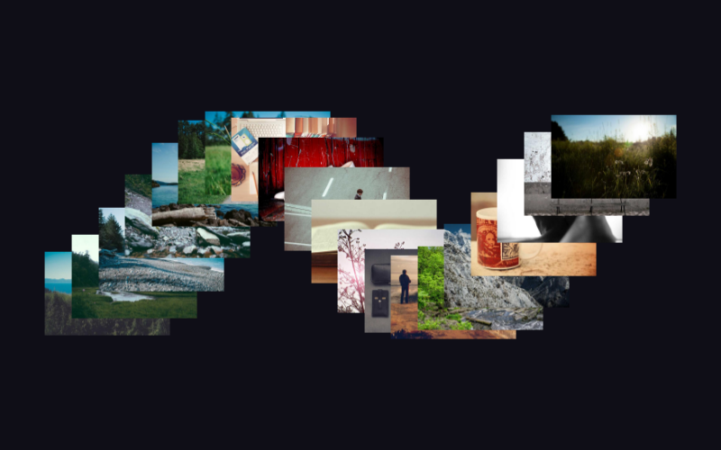
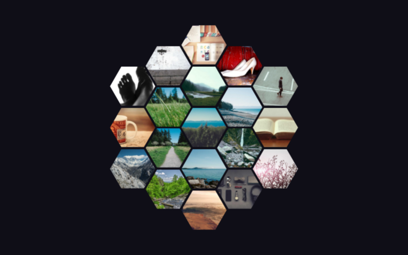
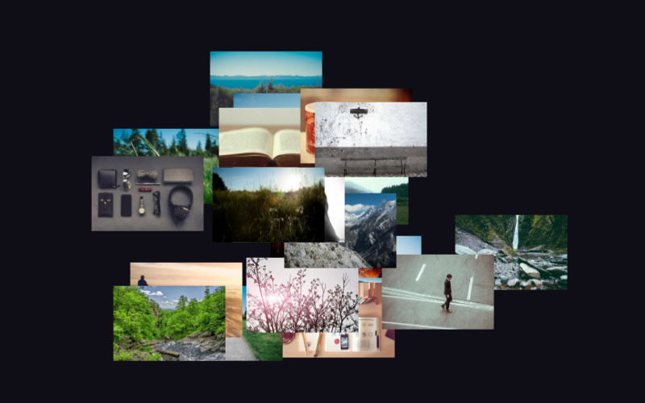

# Layouts

## Implemented

### Radial
Concentric rings emanating from center. Images placed in elliptical rings at increasing radii.



**Configuration options:**
```typescript
layout: {
  algorithm: 'radial',
  radial: {
    tightness: number;  // Ring spacing (0.3-2.0, default: 1.0). Higher = tighter rings.
  },
  scaleDecay: number;   // 0-1: outer rings progressively smaller (default: 0)
}
```

**Visual characteristics:**
- Center image prominently featured at highest z-index
- Rings spread outward with a horizontal oval shape (1.5× wider than tall)
- Ring spacing independent of image size (controlled by `tightness`, not `densityFactor`)
- Works well with 5–30 images

---

### Spiral
Golden ratio spiral emanating outward. Images placed along a logarithmic spiral using the golden angle (~137.5°) for optimal distribution.



**Configuration options:**
```typescript
layout: {
  algorithm: 'spiral',
  spiral: {
    spiralType: 'golden' | 'archimedean' | 'logarithmic';  // default: 'golden'
    direction: 'clockwise' | 'counterclockwise';            // default: 'clockwise'
    tightness: number;    // Spacing between arms (default: 1.0)
    startAngle: number;   // Initial rotation offset in degrees (default: 0)
  },
  scaleDecay: number;     // 0-1: outer images progressively smaller (default: 0)
}
```

**Visual characteristics:**
- Eye naturally drawn to center
- Organic, nature-inspired feel (shells, sunflowers, galaxies)
- Works well with 10–50+ images
- One continuous arm, not concentric rings

---

### Grid
Clean rows and columns with optional stagger.



**Configuration options:**
```typescript
layout: {
  algorithm: 'grid',
  grid: {
    columns: number | 'auto';                    // default: 'auto'
    rows: number | 'auto';                       // default: 'auto'
    stagger: 'none' | 'row' | 'column';         // Brick pattern offset (default: 'none')
    jitter: number;                              // 0–1, random position variance (default: 0)
    overlap: number;                             // 0–1+, image size multiplier (default: 0)
    fillDirection: 'row' | 'column';             // default: 'row'
    alignment: 'start' | 'center' | 'end';      // default: 'center'
    gap: number;                                 // Pixels between cells (default: 0)
    overflowOffset: number;                      // 0–0.5, offset for overflow stacking (default: 0.25)
  }
}
```

**Visual characteristics:**
- Clean, organized, professional
- `stagger: 'row'` gives a brick/masonry feel
- `jitter` + `overlap` creates a "scattered on table" look

**Overflow Mode:**

When both `columns` and `rows` are fixed and image count exceeds available cells:
- Extra images are distributed across cells with positional offsets
- Offset pattern: bottom-right, upper-left, upper-right, bottom-left, then cardinals
- Overflow images render **below** base images (lower z-index) creating a "flow under" effect
- `overflowOffset` controls offset distance as percentage of cell size (default: 0.25 = 25%)

---

### Cluster
Organic clumps with natural spacing. Images grouped into clusters positioned around the container.



**Configuration options:**
```typescript
layout: {
  algorithm: 'cluster',
  cluster: {
    clusterCount: number | 'auto';              // Number of clusters (default: 'auto')
    clusterSpread: number;                      // Radius of each cluster in px (default: 150)
    clusterSpacing: number;                     // Minimum distance between cluster centers (default: 200)
    density: 'uniform' | 'varied';             // Whether clusters vary in size (default: 'uniform')
    overlap: number;                            // 0–1+, how much images overlap within a cluster (default: 0.3)
    distribution: 'gaussian' | 'uniform';      // Image distribution within cluster (default: 'gaussian')
  }
}
```

**Visual characteristics:**
- Organic, grouped feel — good for thematic collections
- `clusterCount: 'auto'` targets ~8 images per cluster based on image count and container size
- `gaussian` distribution keeps most images near each cluster center
- Images closer to cluster center have higher z-index

---

### Wave
Images positioned along flowing sine wave curves across multiple rows.



**Configuration options:**
```typescript
layout: {
  algorithm: 'wave',
  wave: {
    rows: number;                                           // Number of wave rows (default: 1)
    amplitude: number;                                      // Wave height in px (default: 100)
    frequency: number;                                      // Wave cycles across container (default: 2)
    phaseShift: number;                                     // Phase offset between rows in radians (default: 0)
    synchronization: 'offset' | 'synchronized' | 'alternating';  // Row phase relationship (default: 'offset')
  }
}
```

**Synchronization modes:**
- `'offset'` — each row is shifted by `phaseShift` from the previous
- `'synchronized'` — all rows wave in unison (phase = 0 for all)
- `'alternating'` — alternate rows are shifted by π (mirror waves)

**Rotation:** Set `image.rotation.mode = 'tangent'` to align images along the wave curve.

**Visual characteristics:**
- Rhythmic, flowing feel
- Works well with multiple rows for a rich layered effect
- Works well with 8–40 images

---

### Honeycomb
Images arranged in hexagonal rings filling outward from center. Automatically applies a hexagon clip path to images.



**Configuration options:**
```typescript
layout: {
  algorithm: 'honeycomb',
  honeycomb: {
    spacing: number;  // Extra gap in px beyond edge-to-edge (default: 0)
  }
}
```

**Visual characteristics:**
- Uniform, tessellating hexagonal pattern
- Clip path is forced to hexagon (height-relative) — rotation and size variance are ignored to preserve tiling
- Inner rings render above outer rings
- Works well with any image count

---

### Random
Scattered placement with no structure.



No algorithm-specific configuration. Respects shared layout options (`spacing.padding`, etc.) and image options (`rotation`, `sizing.variance`).

**Visual characteristics:**
- Loose, casual feel
- Fully random positions within container bounds

---

## Future Ideas

### Visual Variety Layouts
- **Mosaic** - Variable-sized tiles fitting together
- **Burst/Explosion** - Images radiating outward with velocity falloff
- **Scatter with Physics** - Random with collision avoidance and physics simulation
- **Flow/Stream** - Images follow a curved path

### Content Organization Layouts
- **Timeline** - Chronological arrangement
- **Category/Hierarchy** - Group by metadata or categories
- **Relationship/Connection** - Position based on relationships between images
